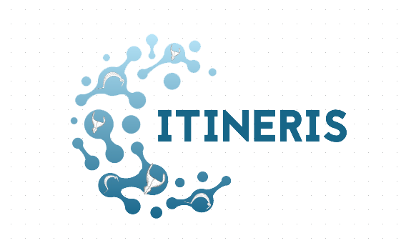

# ANR Itineris 
> Italic metalwork Techniques during the Early Iron AgE. Rethinking cultural InteractionS

GitHub repository of the Itineris ANR project: https://anr.fr/Project-ANR-21-CE27-0010

## package itineRis

Development of an R package for data vizualisation and statistics, [itineRis](https://github.com/zoometh/itineRis#itineris-)

  
   
    <em>Interactive ternary plot created by the <a href="http://shinyserver.cfs.unipi.it:3838/teach/stats/stats/dim3/">isotop_ternaryplot()</a> function </em>

## Talks

**2023** CAA, Amsterdam, ["From thesaurus to semantic network"](https://ANR-Itineris.github.io/itineris/talk/caa-2023/thesaurus)

## Workpackages & Tasks

* **WP1**: Identify craft practicies. Archaeometric analysis

* **WP2**: Social and cultural impact of the foreign productions and innovations in indigenous contexts. Archaeological & Technological analysis

* **WP3**: Protohistoric cultural networks. Data management & Computational archaeology

## GitLab structure

The main folders are:

* [data/](https://gitlab.huma-num.fr/thuet/itineris/-/tree/main/data): raw data, processed data, reference data, etc.

* [dev/](https://gitlab.huma-num.fr/thuet/itineris/-/tree/main/dev): IT and analysis developpements

* [dmp/](https://gitlab.huma-num.fr/thuet/itineris/-/tree/main/dmp): data management plan

* [lod/](https://gitlab.huma-num.fr/thuet/itineris/-/tree/main/lod): linked open data

## Data Management Plan 
> [dmp/](https://gitlab.huma-num.fr/thuet/itineris/-/tree/main/dmp)

The Data Management Plan (DMP) of Itineris project (french: *Plan de Gestion des Données*) is composed on:

* a [**fact sheet**](https://thuet.gitpages.huma-num.fr/itineris/)

* structured data that feed this [**fact sheet**](https://thuet.gitpages.huma-num.fr/itineris/)

  + A resume of [data volume](https://gitlab.huma-num.fr/thuet/itineris/-/blob/main/data/data_resume.tsv) used in Itineris ANR
  
  + A resume of [tools](https://gitlab.huma-num.fr/thuet/itineris/-/blob/main/data/tools_resume.tsv) employed in Itineris ANR
  
  + A resume of [isostandards](https://gitlab.huma-num.fr/thuet/itineris/-/blob/main/data/isos_resume.tsv) used in Itineris ANR 
  
  + A resume of [institutions, members, work pakages, etc.](https://gitlab.huma-num.fr/thuet/itineris/-/blob/main/data/mbr_nodes_resume.tsv) participating in Itineris ANR 
  
If you are a member of the Itineris ANR project, see [how to contribute](https://gitlab.huma-num.fr/thuet/itineris/-/blob/main/dmp/CONTRIBUTING.md) to the preparation of the DMP

## Linked Open Data
> [lod/](https://gitlab.huma-num.fr/thuet/itineris/-/tree/main/lod)

Linked Open Data (LOD) will be manages with thesaurus translations, iso-standards, etc. If you are a member of the Itineris ANR project, see [how to contribute](https://gitlab.huma-num.fr/thuet/itineris/-/blob/main/lod/CONTRIBUTING.md) to the preparation of the DMP

## IT development
> [dev/](https://gitlab.huma-num.fr/thuet/itineris/-/tree/main/dev)

We expect to compute programming scripts ([R](https://www.r-project.org/), [Python](https://www.python.org/) mostly) to resolve statistical analysis for various aspects of the Itineris project:

  + Material analysis
  
  + [3D analysis](https://thuet.gitpages.huma-num.fr/itineris/dev/3d/dev_3d)
  
  + Cartography
  
  + ...

All developments will be stored in the [dev/](https://gitlab.huma-num.fr/thuet/itineris/-/tree/main/dev) folder. See also the [dev/ issue thread](https://gitlab.huma-num.fr/thuet/itineris/-/issues/2)

### 3D
> [dev/3d](https://gitlab.huma-num.fr/thuet/itineris/-/tree/main/dev/3d)

3D developments. See the [HTML 3D dev webpage](https://thuet.gitpages.huma-num.fr/itineris/dev/3d/dev_3d), and also the [dev/3D issue thread](https://gitlab.huma-num.fr/thuet/itineris/-/issues/4)

