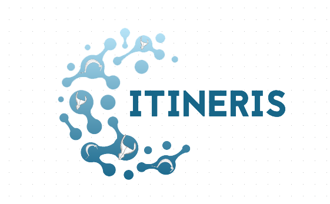

# Contributing 
> Contributing to Itineris ANR

## Linked Open (Data)

If you are a member of the Itineris ANR project, you will have to complete the thesaurus. This thesaurus, [lexicon.xlsx](https://gitlab.huma-num.fr/thuet/itineris/-/blob/main/data/lexicon.xlsx?raw=true), is a correspondances table between french (fra), italian (ita), english (eng) and IdArks. These latter are controlled vocabularies provided by [OpenTheso](https://opentheso.hypotheses.org/) and [PACTOLS](https://pactols.frantiq.fr/opentheso/index.xhtml)

For example, the **cuivre**/*rame*/*copper* record on PACTOLS is:
  
  

The IdArk is [26678/pcrt16pnvNar4g](https://ark.frantiq.fr/ark:/26678/pcrt16pnvNar4g)

### Workflow

VC will collect the C2RMF thesaurus (fre) and find equivalences with the vocabularies in use in Padova (ita)

